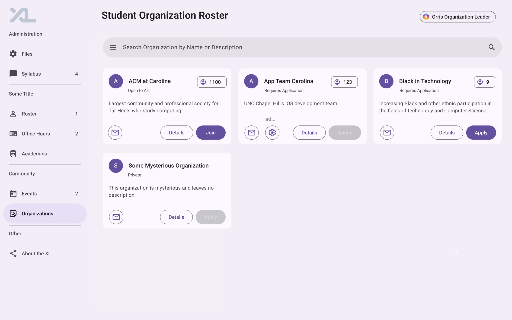
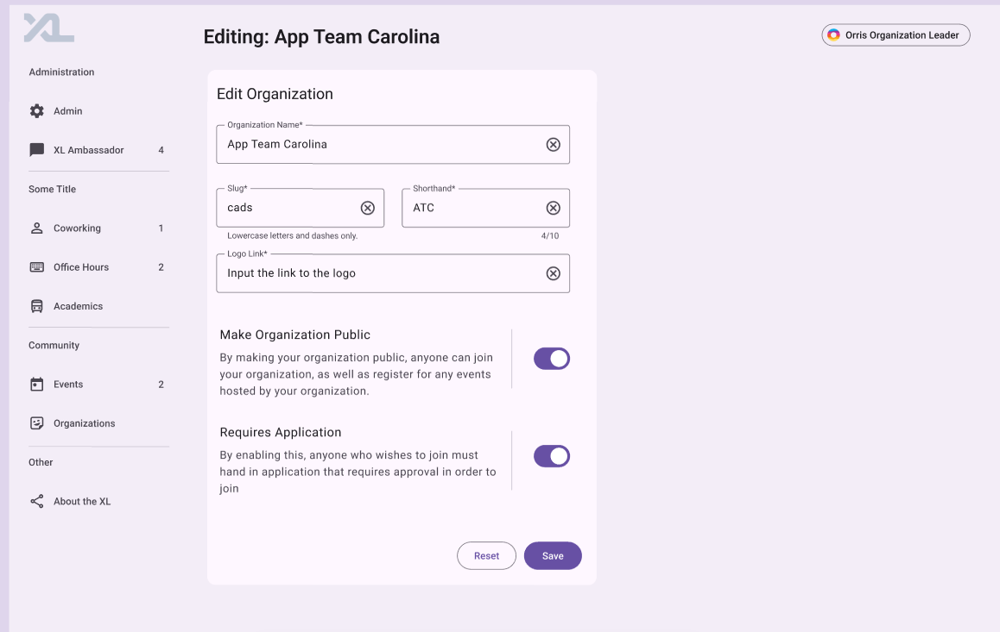

# Project Info

### Title & Team

Title: ProHub - a professional hub for CS student organizations @UNC

Team members: Dan Peng, Haiyun Lyu, Peichun Hua

### Overview

We will help organizations better connect with students and administrators to facilitate the development of both organizations and the computer science community at UNC. To achieve this, the features will include:

1. Organization types for accepting applications
2. Join functionality for users to request membership
3. Accept/deny functions for organization leaders
4. Information tracking for member joining terms
5. Level and title distinctions between members and organization leaders
6. Ability for organization leaders to customize their organization's page on CSXL
7. Roster management for organization members and leaders

Additional features may include organization-specific announcements and activities.

### Key Personas

#### GGbond Guest

- Search the existing organizations by viewing the list of organization and advanced search with filters (organization type)
- View the current organization leaders and their contacts in the organization info-page
- Join the organizations by handing in applications if it’s application-based or by clicking on “join” if it’s open to all
- Check the status of organizations: whether the organization is open to all, requires application/request, or closed

#### Cindy Member

- View member-only content by getting access to members-only announcements, documents, and event details to stay informed and engaged
- Engage in events by attending members-only events in her own channels
- Know her membership with specific academic term(s) especially if the membership is renewed each term
- View the list of organization leaders (public) and other members (private/member-only) by logging into the member-only page and checking the organization information 

#### Oris Organization Leader

- Manage the internal memberships by viewing, accepting, and declining membership requests for application/request-based organizations
- Assign roles by modifying membership levels and titles (e.g., President, Vice President, Treasurer) to members
- Interacting with members by sending messages to members, posting members-only information, such as Slack links, and hosting members-only events 

### User Stories

- As a guest/non-member, I want to search for existing organizations and filter by type, so I can quickly find relevant organizations and apply for ones that I'm interested in
- As a member, I want to get access to members-only announcements, documents, and events, so that I can stay updated with my organization(s)
- As an organization leader, I want to assign and modify titles (e.g., President, Vice President, Treasurer) and approve/reject application to effectively manage the organization

### Wireframes / Mockups

In this page, everyone is able to check the list of all organizations, their status, and various information. Students can apply for those require application.

Here, only authorized students (leaders) are able to update the organiztion information.

Here, the leaders are able to approve or deny students' application to the organization. When clicking the button, the button will slide to accept the students. The organization leader can also choose to press the Student or Leader button to confirm the accepted attendees' level easily. The organization leader is also allowed to type in the optional leadership positions based on the organization's need, for example, Treasurer. The dropdown allows the leader to reuse some of the leadership titles. The organization leader can also easily type and choose the term the attendees join the organization.

Here, everyone in the organization can check out the organization's roster, including the members' levels, roles, and sessions. The triangle button beside the academic term allows the user to see the roster in ascending or descending rank of the joining term. In the example, I designed it to list in ascending order, so the ones who joined the earliest will be shown at the top. 

### Technical Implementation Opportunities and Planning

1. What specific areas of the existing code base will you directly depend upon, extend, or integrate with?

   - Current organization-admin, organization-details, organization-editor, organization-page in frontend

   - Current API endpoints for user.py and organization.py management in backend 

   - Current User authentication system 

2. What planned page components and widgets do you anticipate needing in your feature’s frontend?

   - Page components
     - Organization Roster
     - Organization Information Editing
     - Student Information List
     - Student Application Management
     - Announcement Posting
     - Application Page

   - Widgets
     - `<search-bar>` 
     - `<organization-card>`
     - `<email-button> `
     - `<user-sidebar>`

3. What additional models, or changes to existing models, do you foresee needing (if any)?

   1. Allow organization leaders to access organization editor and organization detail 
   2. Add organization roster model 
   3. Add organization member adding model 

4. Considering your most-frequently used and critical user stories, what API / Routes do you foresee modifying or needing to add?

   - GET /api/organizations

   - POST /api/organizations

   - PUT /api/organization/:org_id

   - GET /api/organizations/:org_id/members

   - POST /api/organizations/:org_id/members

   - PUT /api/organization/:org_id/members/:member_id

5. What concerns exist for security and privacy of data? Should the capabilities you are implementing be specific to only certain users or roles? (For example: When Sally Student makes a reservation, only Sally Student or Amy Ambassador should be able to cancel the reservation. Another student, such as Sam Student, should not be able to cancel Sally’s reservation.)

   1. Students who do not join the specific organization should not be able to view the member-only announcements/events.
   2. Students who are not the leader of the organization should not be able to handle applications, or change other students’ status (level, title, academic term etc.).
   3. Students who are not the leader of the organization should not be able to change the information of the organization.
   4. Students outside of the closed organization should not be able to hand in applications to that organization.
